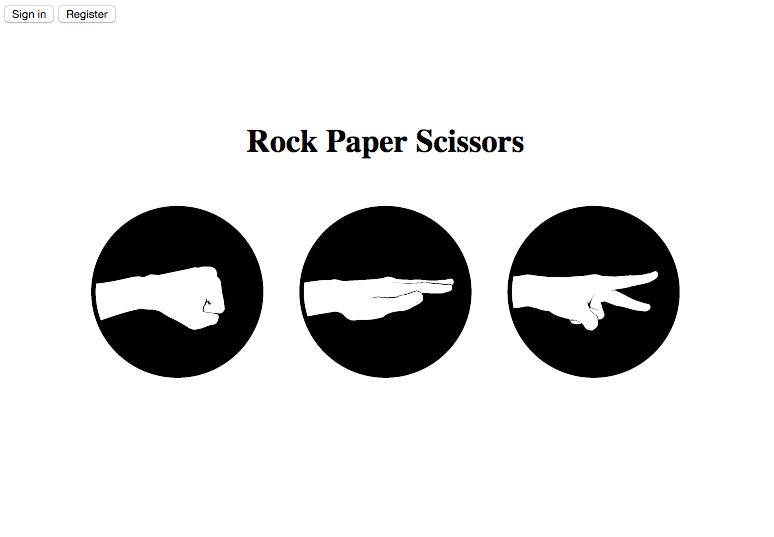

# RPS Challenge





This is a basic two-player rock-scissors-paper game using Pusher. You can play the game on two different computers with your friends. If you're by yourself, you can also play with computer. More fun with your friend though!  


Demo
----
Visit https://rock--paper--scissors.herokuapp.com/

Use the username and password below if you don't want to sign up.
Player 1
name: Alice
password: password

Player 2
name: Bob
password: password

Getting Started
-----
```
$ git clone git@github.com:jongmin141215/rps-challenge.git
$ cd rps-challenge
$ rackup
```

Visit http://localhost:9292


Running tests
------
To run RSpec:
```
$ rspec
```

Features
-----
* Users can play rock-scissors-paper with their friend.
* Users can play with computer.

Technologies
-----
* Web Framework: Sinatra
* Testing: RSpec, Capybara
* Hosting: Heroku
* Persistence: DataMapper
